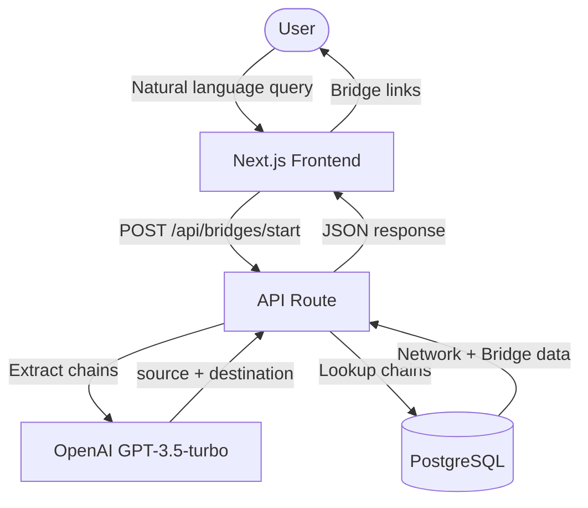
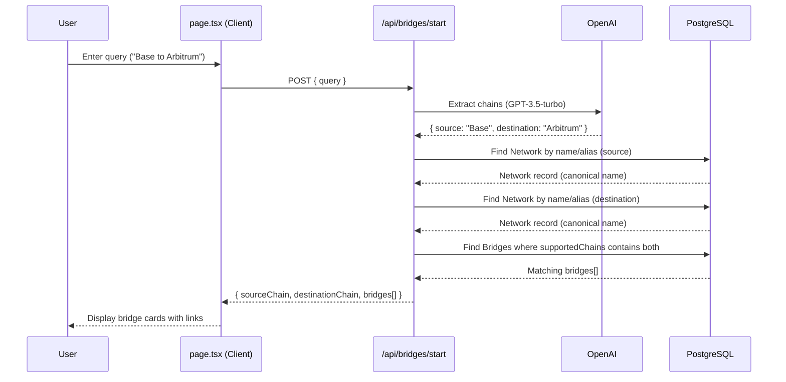
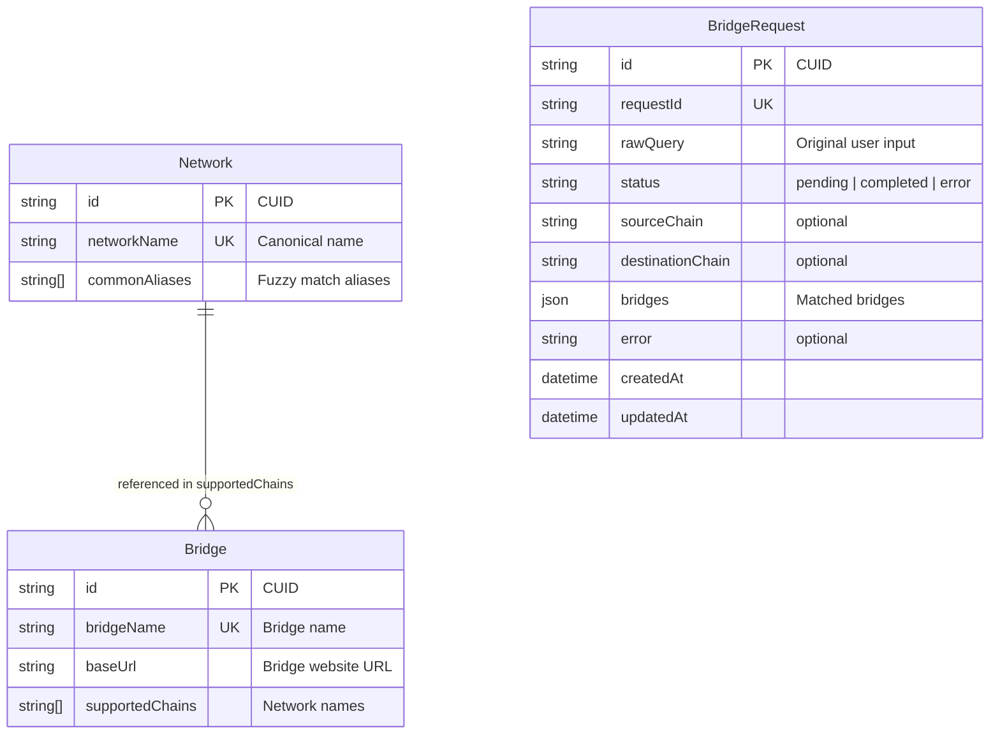
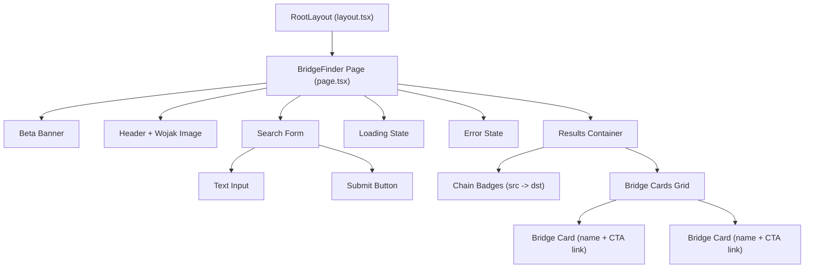
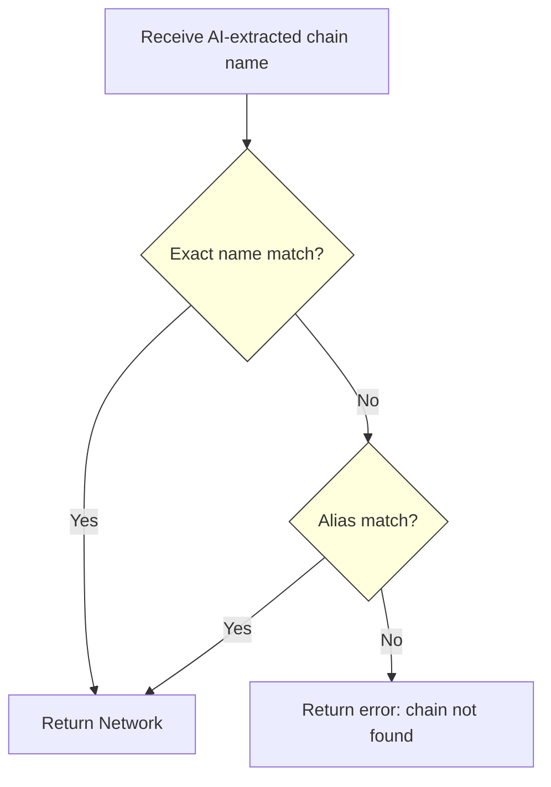
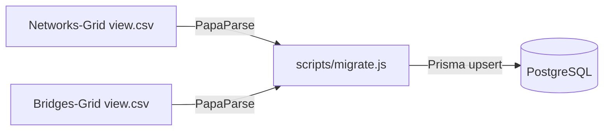
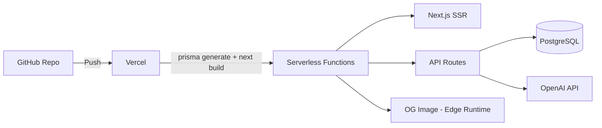

# Technical Architecture

## System Overview

## Request Flow

## Database Schema

## Component Architecture

## Chain Matching Logic

The chain matching uses a two-step fuzzy lookup:
1. **Exact match** - case-insensitive search on `networkName`
2. **Alias match** - checks if the AI-extracted name appears in `commonAliases` array

## Data Seeding Pipeline

CSV files from Airtable are parsed and upserted into the database. The migration script handles alias normalization (e.g., zkSync Era special case).

## Deployment Architecture

## Key Design Decisions

| Decision | Rationale |
|----------|-----------|
| GPT-3.5-turbo for extraction | Cost-effective for simple JSON extraction task |
| String array for supportedChains | Simple bridge-to-chain mapping without join table |
| Alias-based fuzzy matching | Handles user variations ("eth" vs "Ethereum") |
| Single page app | Simple UX - one input, one result |
| Edge runtime for OG images | Fast social preview generation |
| CSV seed data | Easy data management from Airtable exports |
